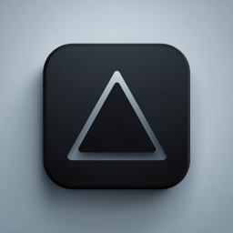
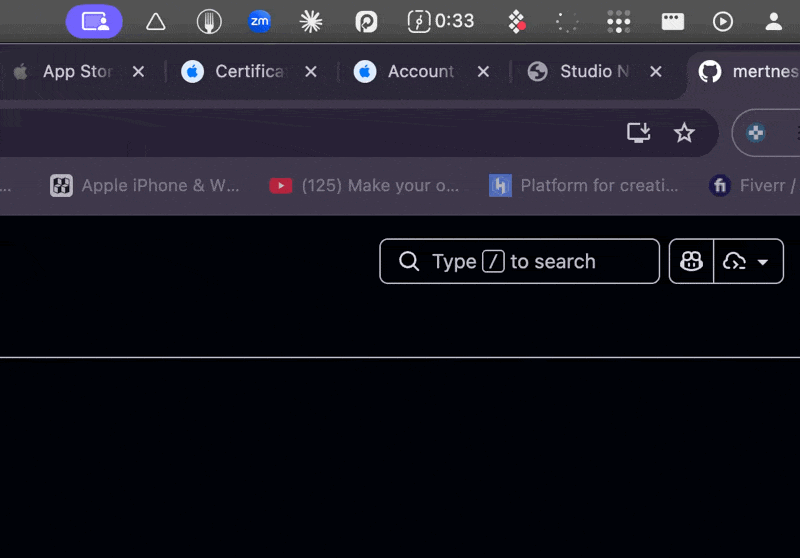
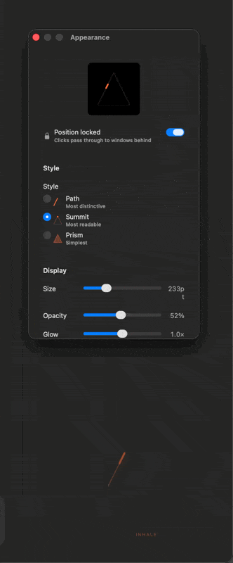

<p align="center">
  
</p>

<h1 align="center">BackgroundBreath</h1>

<p align="center">
  A macOS menu-bar breathing companion that floats as a transparent triangle overlay on your desktop.
  <br>
  <em>Breathe with intention. Stay in flow.</em>
</p>

<p align="center">
  <a href="https://github.com/mertnesvat/backgroundbreath/releases/latest">
    
  </a>
  
  
  <a href="LICENSE">
    
  </a>
</p>

---

## Why?

Slow, rhythmic breathing activates the parasympathetic nervous system — reducing cortisol, lowering heart rate, and sharpening focus. But breathing apps demand your attention. They pull you out of what you're doing.

**BackgroundBreath** takes a different approach. It sits quietly on your desktop as a small, transparent triangle. It breathes with you — or for you — while you work. Glance at it when you need a cue. Ignore it when you don't. It's ambient by design.

## How It Works

<p align="center">
  
</p>

The breathing indicator is a **triangle drawn as a continuous path**. Each edge maps to a phase of your breath:

```
        /\          Apex = full inhale
       /  \
      /    \        Left edge  = inhale (ascending)
     /      \       Right edge = exhale (descending)
    /________\      Base       = hold / rest
```

The triangle tells a spatial story: inhale climbs, exhale descends. You always know where you are in the breath cycle by where the activity is on the triangle.

<p align="center">
  
</p>

## Features

### Three Breathing Styles

| Style | Description |
|-------|-------------|
| **Path** | The triangle is drawn and dissolved by your breath. Only ~1/3 exists at any moment — ephemeral, like breath itself. |
| **Summit** | A permanent ghost triangle with a bright dot tracing the edges. The most readable at a glance. |
| **Prism** | A translucent triangle that rotates — points up on inhale, down on exhale. The simplest style. |

### Six Breathing Patterns

| Pattern | Timing | Best For |
|---------|--------|----------|
| Resonance | 5.5s in – 5.5s out | Heart rate variability, daily calm |
| Coherent | 6s in – 6s out | Sustained focus |
| Box | 4s in – 4s hold – 4s out – 4s hold | Stress reset, Navy SEAL technique |
| 4-7-8 | 4s in – 7s hold – 8s out | Sleep preparation, deep relaxation |
| Physiological Sigh | 2s in – 1s hold – 8s out | Quick calm, anxiety relief |
| Energizing | 4s in – 2s hold – 6s out | Morning activation |

### Customization

- **Size**: 30pt to 800pt — from a subtle corner presence to a full meditation focus
- **Opacity**: 10% to 100% — barely there or fully visible
- **Glow**: Adjustable glow intensity around the triangle
- **Colors**: Per-phase hue control for inhale, exhale, and hold
- **Position**: Drag anywhere on screen, then lock in place (clicks pass through)
- **Label**: Optional phase label (inhale / exhale / hold)

### Ambient by Design

- Transparent overlay — see and click through to your work
- Floats across all Spaces and full-screen apps
- Menu bar only — no Dock icon, no window clutter
- Launch at login — always there when you need it
- ~700KB app size — no bloat

## Install

### Download (Recommended)

1. Grab the latest `.dmg` from [**Releases**](https://github.com/mertnesvat/backgroundbreath/releases/latest)
2. Open the DMG and drag **BackgroundBreath** to Applications
3. Launch it — a triangle icon appears in your menu bar

> **Note**: On first launch, macOS may show a security warning since the app isn't notarized. Right-click → Open to bypass it, or go to System Settings → Privacy & Security → Open Anyway.

### Build from Source

Requires Xcode 15+ and [XcodeGen](https://github.com/yonaskolb/XcodeGen).

```bash
git clone https://github.com/mertnesvat/backgroundbreath.git
cd backgroundbreath
xcodegen generate
open BackgroundBreath.xcodeproj
# Cmd+R to build and run
```

Set your own `DEVELOPMENT_TEAM` in `project.yml` if you want to sign the build.

## Usage

1. **Menu bar**: Click the triangle icon (▲) for controls
2. **Breathing pattern**: Choose from the Breathing Pattern submenu
3. **Appearance**: Open Appearance (⌘,) to customize style, size, colors
4. **Position**: Drag the triangle to where you want it, then toggle Lock in settings
5. **Pause/Resume**: Toggle from the menu bar when you need a break

## Architecture

BackgroundBreath is a lightweight macOS app (~700 lines of Swift) with no dependencies.

```
BackgroundBreath/
├── BreathOverlayApp.swift      # App entry point (@NSApplicationDelegateAdaptor)
├── AppDelegate.swift           # Menu bar, floating panel, settings windows
├── FloatingPanel.swift         # Custom NSPanel (transparent, always-on-top)
├── BreathTimer.swift           # Phase cycling with continuous progress tracking
├── BreathPattern.swift         # 6 breathing pattern definitions
├── BreathSettings.swift        # UserDefaults-backed settings (ObservableObject)
├── BreathStyle.swift           # Style enum (path, summit, prism)
├── TrianglePath.swift          # Shared triangle Shape + phase-to-edge mapping
├── TriangleBreathView.swift    # All three triangle style implementations
├── BreathAnimationView.swift   # Legacy circle view (kept as reference)
└── SettingsView.swift          # Settings UI + About view
```

**Key design decisions:**
- `TimelineView(.animation)` drives continuous animation — no CADisplayLink or high-frequency timers
- Phase progress is computed from wall clock (`phaseStartDate` + elapsed time), not accumulated ticks
- `Canvas` API for Path and Summit styles — efficient single-pass drawing
- TimelineView stops entirely when paused — zero CPU cost
- All settings persist via `UserDefaults` with `@Published` + `didSet`

## Roadmap

- [ ] Custom breathing patterns (user-defined timings)
- [ ] Keyboard shortcut to toggle breathing on/off
- [ ] Multiple triangles with different patterns
- [ ] Haptic feedback integration (for MacBooks with haptic trackpads)
- [ ] Menu bar icon animation reflecting current breath phase
- [ ] Breath session statistics (minutes today, streak)
- [ ] Export/import settings and custom patterns
- [ ] Notarization for smoother first-launch experience

## Contributing

Contributions are welcome! This is a small, focused app — keep it that way.

1. Fork the repo
2. Create a feature branch (`git checkout -b feature/my-feature`)
3. Make your changes
4. Run tests: `xcodebuild -scheme BackgroundBreath -destination 'platform=macOS' test`
5. Open a PR

**Guidelines:**
- Keep the app lightweight — no external dependencies
- New visual styles are welcome (follow the existing pattern in `TriangleBreathView.swift`)
- Test on macOS 13+ (Ventura)

## Credits

Built by [Studio Next](https://studionext.co.uk).

## License

MIT License — see [LICENSE](LICENSE) for details.
